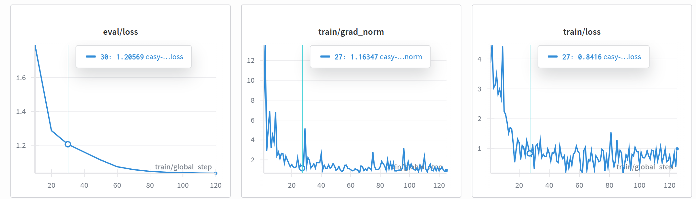

# POINTS-Reader Deploy and Fine-tuning

## 模型架构

https://huggingface.co/tencent/POINTS-Reader

- llm
    - model
        - embed_tokens
        - layers
            - 0
                - input_layernorm
                - mlp
                    - down_proj
                    - gate_proj
                    - up_proj
                - post_attention_layernorm
                - self_attn
                    - o_proj
                    - q_proj
                    - k_proj
                    - v_proj
        - norm
    - lm_head
- vision_encoder
    - patch_embed.proj
    - blocks
        - 0
            - attn
                - proj
                - qkv
            - mlp.fc1
            - mlp.fc2
            - norm1
            - norm2
    - merger
        - ln_q
        - mlp
            - 0
            - 2
- vision_projector
    - ln_q
    - mlp
        - 0
        - 2


## 部署

```bash
# export HF_ENDPOINT=https://hf-mirror.com
hf download tencent/POINTS-Reader --local-dir models/POINTS-Reader

cd WePOINTS
pip install -e .
cd ../
```

transformer

```bash
python inference.py
```

配置支持 few-shot，但是只能用在很特殊的场景（数据同质化严重）
配置2个Prompt，默认的Prompt效果就不错。

gradio app

```bash
pip install gradio
python app.py
```

sglang (TODO)
```bash
conda create -n sglang python=3.12
cd sglang/
conda activate sglang
pip install --upgrade pip
pip install -e "python[all]"

cd ../
python3 -m sglang.launch_server \
--model-path models/POINTS-Reader \
--served-model-name POINTS-Reader \
--tp-size 1 \
--dp-size 1 \
--chat-template points-v15-chat \
--trust-remote-code \
--port 8081
```

## 微调

```bash
pip install accelerate trl

# 单卡Lora训练（24G显卡），训练vision_projector和llm部分。
python train_wepoints.py \
    --model_name_or_path "models/POINTS-Reader" \
    --dataset_name "axolotl-ai-co/llava-instruct-mix-vsft-small" \
    --per_device_train_batch_size 1 \
    --gradient_accumulation_steps 4 \
    --output_dir ./pointsv15-sft-lora-output \
    --learning_rate 1e-4 \
    --num_train_epochs 1 \
    --logging_steps 1 \
    --do_eval True \
    --eval_strategy "steps" \
    --eval_steps 30 \
    --save_strategy "steps" \
    --save_steps 30 \
    --bf16 True \
    --use_peft \
    --lora_r 64 \
    --lora_alpha 128 \
    --lora_target_modules "q_proj,k_proj,v_proj,o_proj,gate_proj,up_proj,down_proj,vision_projector.mlp.0,vision_projector.mlp.2" \
    --warmup_ratio 0.1 \
    --lr_scheduler_type cosine \
    --weight_decay 0.01 \
    --gradient_checkpointing True \
    --only_one_turn False
```



自定义的数据集需要处理为 `axolotl-ai-co/llava-instruct-mix-vsft-small` 相同格式，注意user prompt 和 inference.py 中相同。